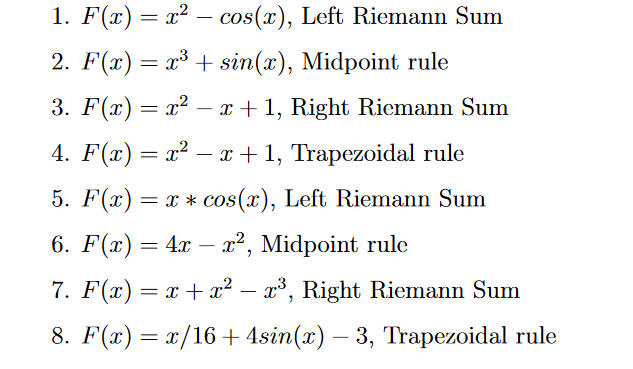

Вам даны функция и метод численного интегрирования. Нужно реализовать функцию, которая принимает на вход диапазон численного интегрирования и вычисляет результат для заданной функции (вариант на выбор).

Функция, которую будем интегрировать, должна передаваться в функцию интегрирования как параметр. Интервал интегрирования (2 точки) нужно получить с помощью функции prompt. Количество точек интегрирования - на усмотрение студента. Описание методов: https://en.wikipedia.org/wiki/Riemann_sum

Нужно загрузить в Moodle код (ссылка на Github или архив) с решением.
Задание сдается очно, нужно показать код и пример работы приложения преподавателю.